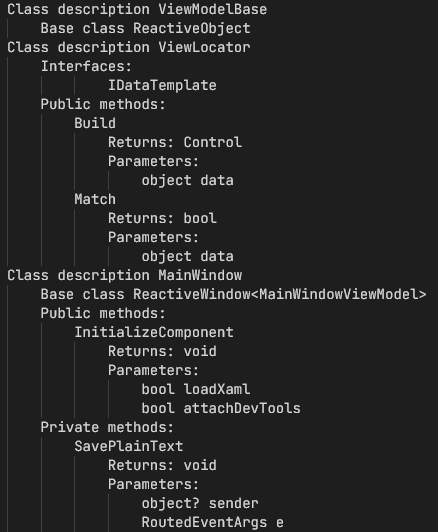

# SKProCH.StudentThings
> Set of utilities to make student's life a bit easier
- English description [here](#english)
- Русское описание [тут](#russian)

## English
> ⚠️ This project is being developed for personal use, and most likely, I will not be implementing feature requests or anything like that.  
> However, you can always send a pull request that implements some important functionality for you.
### ClassesSummarizer
This tool generates a report on the classes and their contents and puts them in a separate file during project build. 
> It was useful for my coursework, where I needed to provide a list of classes in the project. The task looks like this:  
> For each program class that is part of the software system, a detailed description is given:  
> - Base class for the current class;  
> - List of class interfaces;  
> - List of class constants;  
> - List of internal class fields;  
> - List of public class methods;  
> - List of internal class methods.  
> For constants and internal class fields, their data type and purpose are indicated.  
> For external and internal class methods, the name, input data (description of parameters), executed function, and output data (return value) are specified.  

The result of the tool's work is a file with a JSON structure and a file with the following structure:  



#### Usage
1. Install the [`SKProCH.StudentThings.ClassesSummarizer` package from NuGet](https://www.nuget.org/packages/SKProCH.StudentThings.ClassesSummarizer):
    ```shell
    dotnet add package SKProCH.StudentThings.ClassesSummarizer
    ```
2. Build the project
3. The result files are located in the bin folder of the project.

## Russian
> ⚠️ Данный проект делается для себя, и скорее всего, я не буду реализовывать запросы на фичи или что-то такое.  
> Но, вы всегда можете прислать PR, реализующий какой-то важный для вас функционал.
### ClassesSummarizer
Собирает отчёт о классах и их содержимом и складывает их в отдельный файл при сборке проекта. 
> Мне было это необходимо для курсовых работ, в которых необходимо привести список классов в проекте. Задание выглядит так:  
> Для каждого класса программ, входящих в программную си-стему, приводится подробное описание:  
> -	базовый класс для текущего класса;  
> -	перечень интерфейсов класса;  
> -	перечень констант класса;  
> -	перечень внутренних полей класса;  
> -	перечень общедоступных методов класса;  
> -	перечень внутренних методов класса.  
> Для констант и внутренних полей класса указывают их тип дан-ных и назначение.  
> Для внешних и внутренних методов класса указывают название, входные данные (описание параметров), выполняемую функцию, выходные данные (возвращаемое значение).  

Результат работы - файл с JSON структурой и файл со следующей структурой:  
  

#### Использование
1. Установить [пакет `SKProCH.StudentThings.ClassesSummarizer` из NuGet](https://www.nuget.org/packages/SKProCH.StudentThings.ClassesSummarizer):
    ```shell
    dotnet add package SKProCH.StudentThings.ClassesSummarizer
    ```
2. Собрать проект
3. Файлы результата находятся в папке `bin` проекта
